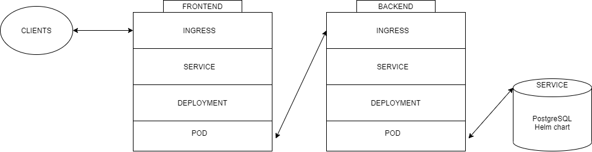
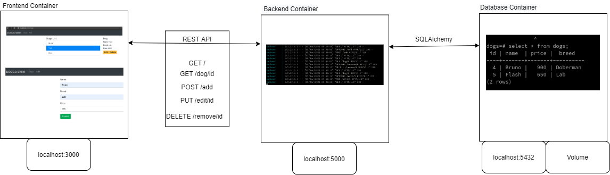

# three-tier-application
A containerized three-tier application with frontend, backend, database orchestrated with Kubernetes written Infrastructure as Code

## Requirements
### Please make sure you have the correct version of:
1. terraform -> Terraform v0.13.6
2. awscli -> aws-cli/1.16.113 with proper credentials 
3. kubectl -> Client Version: version.Info{Major:"1", Minor:"20", GitVersion:"v1.20.4", GitCommit:"e87da0bd6e03ec3fea7933c4b5263d151aafd07c", GitTreeState:"clean", BuildDate:"2021-02-18T16:12:00Z", GoVersion:"go1.15.8", Compiler:"gc", Platform:"linux/amd64"}
4. OS -> any Linux distribution (doesn't work on windows)

## Instructions
### For IaC
1. To create EKS cluster AWS, deploy helm, ingress-controller, frontend and backend please run the command:
```./infra/terraform/three-tier-script.sh```
2. You can destroy the cluster and all terraform managed resources using the destroy script, simply run:
  ```./infra/terraform/destroy-script.sh```
### For 3-tier application on localhost
1. To run frontend, backend and database locally, navigate to the root directory of the folder and run:  
```docker-compose build && docker-compose up```
## Repo Design
The three folders frontend, backend and database resent the actual containerised code for frontend, backend and database. The infra folder contains Infrastructure as Code written in terraform and contains modules for frontend and backend. 

## Design Infrastructure
The infrstucture consists of many opensource components including the actual [eks-terraform code](https://learn.hashicorp.com/tutorials/terraform/eks), [postgresql database](https://github.com/bitnami/charts/tree/master/bitnami/postgresql), [ingress-controler](https://github.com/kubernetes/ingress-nginx).
Resources created by K8s can be visualised using [this file](docs/graph.pdf). As there are 52 resources created, the infrastructure diagram created by terraform is used.
After the cluster is deployed we automate the deployment of common components such as PostgreSQL and ingress-controller using community helm charts and deploying them using [helm](https://helm.sh/). Also, frontend and backend modules are deployed by terraform which consists of service, deployment and ingress. The flow between these can be visualised using the graph below.

The frontend UI doesn't work right on Kubernetes because it needs a domain name to be hosted and to communicate to the backend. 

## Design 3-tier application
3 containers are run together with help of docker-compose. The diagram below describes the flow of the entire system.



## Architectural Decisions
1. Terraform for IaC and automation: Provides consistent CLI workflow to manage AWS, Kubernetes and Helm
2. Helm for resource deployment: Reduces deployment complexity and provides standardized and reusable deployment options by providing easy to install helm chart for complex applications like ingress-controller.
3. Postgresql as database: Easy to set-up and use database for structured data that has huge community backing.
4. React for frontend: Provides encapsulated components that manage their state, uses Virtual DOM that applies changes in real-time.
5. Flask for backend: Provides lightweight and modular design, built-in development server, fast debugging and RESTful request dispatching.

## Future Improvements
1. Adding [cert-manager](https://github.com/jetstack/cert-manager) to automate the management and issuance of TLS certificates.
2. Purchasing domain name to host the website and backend. 
3. Containerising infra scripts to make the code portable.

